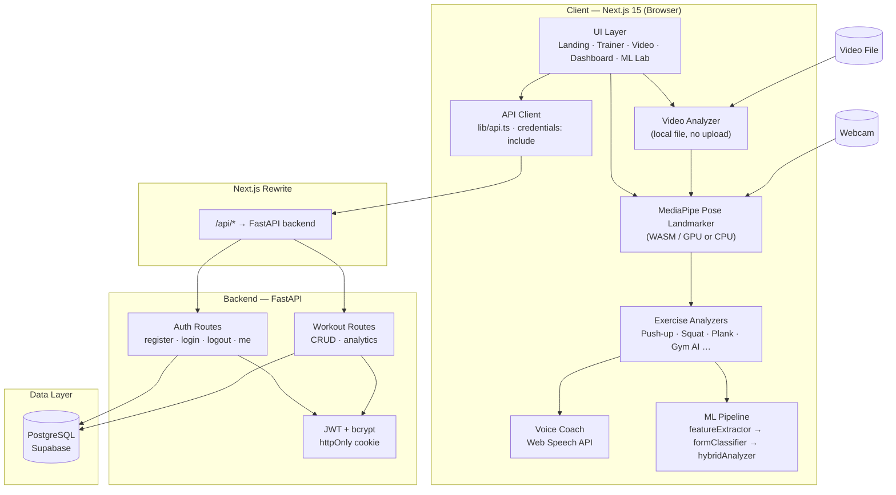
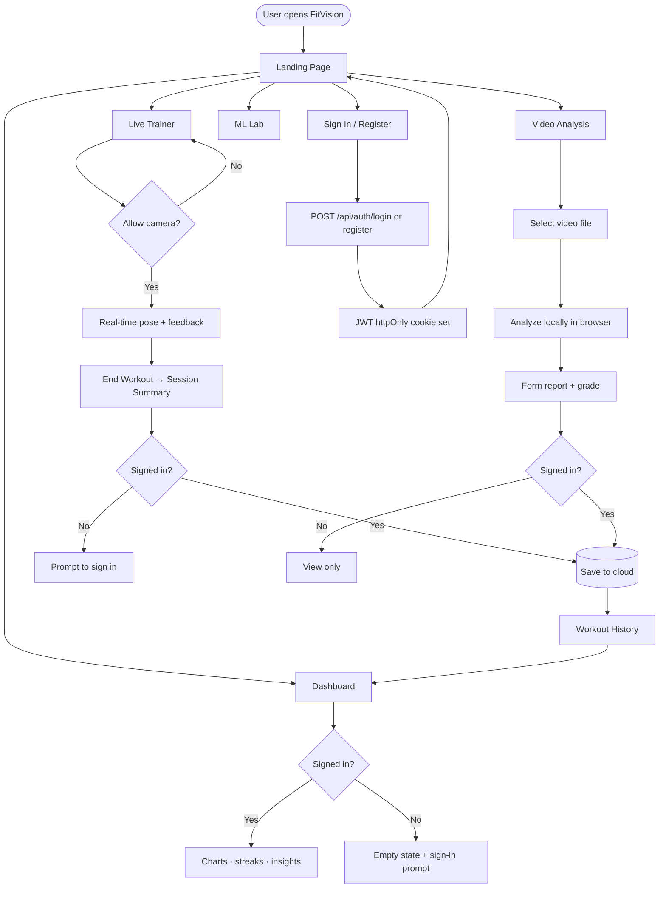
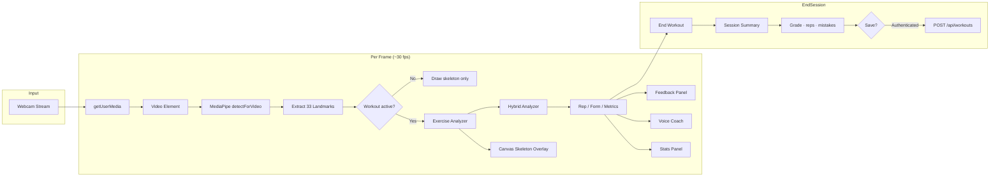
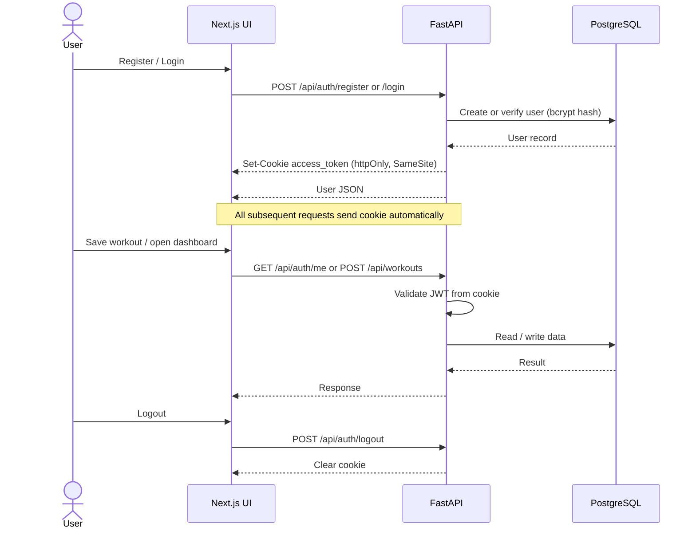
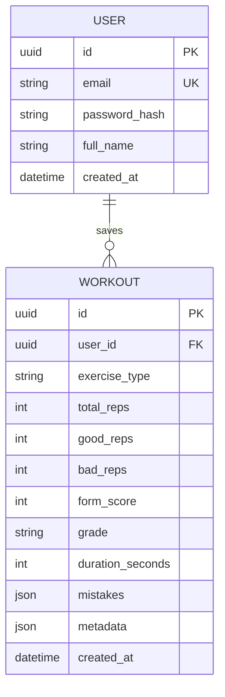
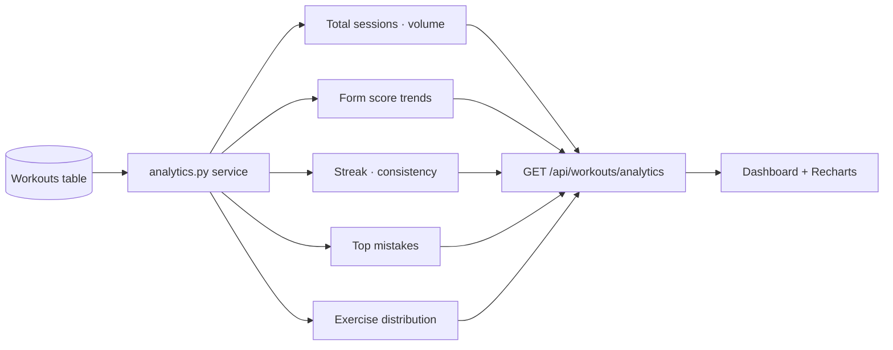
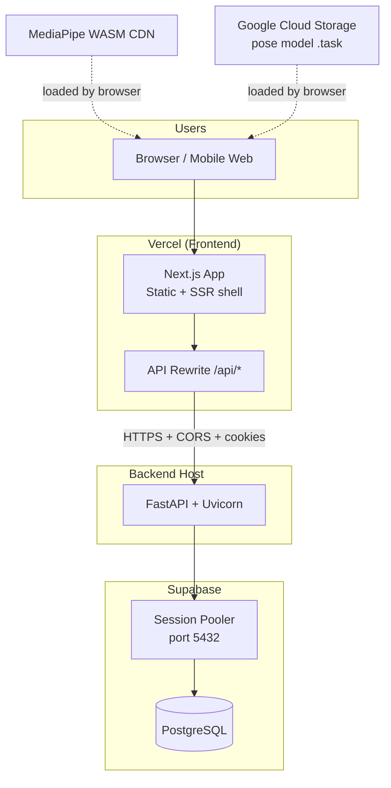

# FitVision AI

**Train smarter with real-time AI form correction.**

FitVision AI is a full-stack browser fitness platform that combines live pose detection, voice coaching, workout history, progress analytics, video analysis, and experimental ML assist — without expensive hardware or paid vision APIs.

> **Disclaimer:** FitVision AI provides general fitness feedback and is not a medical or professional coaching substitute.

## Screenshots

<!-- Add screenshots here after deployment -->
| Landing | Live Trainer | Dashboard |
|---------|--------------|-----------|
| _screenshot_ | _screenshot_ | _screenshot_ |

## Features

- **Live AI Trainer** — Webcam pose detection, rep counting, form feedback, voice coach
- **Gym AI Mode** — Auto-detect exercises and suggest what to train next
- **Video Analysis** — Upload MP4/MOV/WebM for local frame-by-frame analysis
- **Progress Dashboard** — Charts, streaks, insights, mistake trends
- **Workout History** — Cloud-synced sessions with JWT httpOnly cookie auth
- **ML Lab** — Experimental hybrid classifier + dataset export for future TF.js models
- **9+ Exercises** — Push-up, squat, plank, curls, lunges, presses, and more

## Tech Stack

| Layer | Technology |
|-------|------------|
| Frontend | Next.js 15, TypeScript, Tailwind CSS, Recharts, MediaPipe |
| Backend | FastAPI, SQLAlchemy, Alembic, Pydantic |
| Database | PostgreSQL (Supabase) |
| Auth | JWT in httpOnly cookies (bcrypt password hashing) |
| ML (MVP) | Heuristic classifier + feature extraction pipeline |

## Architecture

```
Browser (Next.js)
├── MediaPipe Pose Landmarker (client-side)
├── Exercise analyzers + voice coach
├── Video analysis (local, no upload)
└── API proxy /api/* → FastAPI backend

FastAPI Backend
├── Auth (register/login/logout/me)
├── Workout CRUD + analytics
└── PostgreSQL (Supabase)

ML Pipeline (client)
├── featureExtractor.ts → 20-dim pose vectors
├── formClassifier.ts → pluggable classifier interface
└── hybridAnalyzer.ts → rule-based + ML assist
```

---

## System Design

FitVision AI uses a **browser-first architecture**: pose detection, video analysis, and ML inference run entirely in the client. The backend is responsible only for **identity**, **persistence**, and **analytics aggregation** — keeping latency low and video data private.

### High-Level Architecture



### Component Responsibilities

| Component | Responsibility | Runs where |
|-----------|----------------|------------|
| **MediaPipe Pose Landmarker** | 33 body landmarks per frame | Browser |
| **Exercise Analyzers** | Rep counting, phase detection, form scoring | Browser |
| **Hybrid Analyzer** | Rule engine + optional ML assist hints | Browser |
| **Voice Coach** | Spoken feedback with cooldown | Browser |
| **Video Upload Analyzer** | Frame-by-frame offline analysis | Browser (no server upload) |
| **FastAPI Auth** | Register, login, JWT cookie sessions | Server |
| **Workout Service** | Save/list/delete sessions + analytics | Server |
| **PostgreSQL** | Users, workout records, aggregated stats | Supabase |

### User Journey Flow



### Live Trainer — Real-Time Pipeline



### Authentication Flow



### Video Analysis Flow (Privacy-First)

```mermaid
flowchart TD
    A[User selects MP4 / MOV / WebM] --> B[FileReader + HTMLVideoElement]
    B --> C[Frame loop in browser]
    C --> D[MediaPipe per frame]
    D --> E[Exercise analyzer]
    E --> F[Aggregate report]
    F --> G[VideoAnalysisReport UI]

    G --> H{User signed in?}
    H -->|Yes| I[Optional save as workout via API]
    H -->|No| J[Report stays local]

    style B fill:#1a1a2e
    style C fill:#1a1a2e
    style D fill:#1a1a2e
    style E fill:#1a1a2e

    NOTE["Video never uploaded to server"]
    C -.-> NOTE
```



### Data Model



### Analytics Pipeline



### Deployment Topology



### Design Decisions

| Decision | Choice | Rationale |
|----------|--------|-----------|
| Pose detection location | Client-side (MediaPipe) | Zero video latency; no GPU server cost |
| Video analysis | Local only | Privacy; no storage/bandwidth for large files |
| Auth token storage | httpOnly cookie | XSS-resistant vs localStorage JWT |
| API routing | Next.js rewrite to FastAPI | Same-origin `/api` in dev; simple CORS in prod |
| Database | Supabase PostgreSQL | Managed Postgres + pooler for serverless backends |
| ML (v1) | Heuristic + feature vectors | Ship MVP without training infra; TF.js path in ML Lab |
| Password hashing | bcrypt (native) | Reliable on Windows; avoids passlib issues |

### Scalability Notes

- **Frontend** scales horizontally on Vercel edge/CDN — each user runs their own pose pipeline.
- **Backend** is stateless; scale Uvicorn workers behind a load balancer.
- **Database** connection pooling via Supabase session pooler; index `user_id` + `created_at` on workouts for analytics queries.
- **Bottleneck** is per-device CPU/GPU for MediaPipe, not server load — architecture supports many concurrent users without processing video centrally.

---

### Prerequisites

- Node.js 18+
- Python 3.11+
- PostgreSQL (Supabase recommended)
- Webcam (for live trainer)

### Frontend

```bash
npm install
cp .env.example .env.local
npm run dev
```

Open [http://localhost:3000](http://localhost:3000)

### Backend

```bash
cd backend
python -m venv venv
venv\Scripts\activate        # Windows
pip install -r requirements.txt
cp .env.example .env
# Edit .env — DATABASE_URL, JWT_SECRET_KEY, FRONTEND_URL
alembic upgrade head
uvicorn app.main:app --reload --port 8001
```

> **Note:** Port 8001 is used if 8000 is occupied. Update `NEXT_PUBLIC_API_URL` in `.env.local` to match.

### Database Migrations

```bash
cd backend
alembic upgrade head          # Apply migrations
alembic revision --autogenerate -m "description"  # New migration
alembic downgrade -1          # Rollback one step
```

## Environment Variables

### Frontend (`.env.local`)

| Variable | Description |
|----------|-------------|
| `NEXT_PUBLIC_API_URL` | Backend URL for Next.js API rewrites |

### Backend (`backend/.env`)

| Variable | Description |
|----------|-------------|
| `DATABASE_URL` | PostgreSQL connection string (Supabase pooler recommended on Windows) |
| `JWT_SECRET_KEY` | Secret for signing JWT tokens |
| `FRONTEND_URL` | CORS origin(s), comma-separated for multiple |
| `COOKIE_SECURE` | `true` in production (HTTPS) |
| `COOKIE_SAMESITE` | `lax` recommended |

## API Endpoints

| Method | Path | Auth | Description |
|--------|------|------|-------------|
| GET | `/api/health` | No | Health check |
| POST | `/api/auth/register` | No | Create account |
| POST | `/api/auth/login` | No | Sign in (sets cookie) |
| POST | `/api/auth/logout` | No | Sign out |
| GET | `/api/auth/me` | Yes | Current user |
| POST | `/api/workouts` | Yes | Save workout |
| GET | `/api/workouts` | Yes | List workouts |
| GET | `/api/workouts/analytics` | Yes | Progress analytics |
| GET | `/api/workouts/{id}` | Yes | Get workout |
| DELETE | `/api/workouts/{id}` | Yes | Delete workout |

## Deployment

### Frontend (Vercel recommended)

1. Push repo to GitHub
2. Import project in Vercel
3. Set `NEXT_PUBLIC_API_URL` to your backend URL
4. Deploy

### Backend (Railway, Render, Fly.io, etc.)

1. Set all variables from `backend/.env.example`
2. Set `FRONTEND_URL=https://your-frontend.vercel.app`
3. Set `COOKIE_SECURE=true` for HTTPS
4. Run migrations: `alembic upgrade head`
5. Start: `uvicorn app.main:app --host 0.0.0.0 --port $PORT`

### Production CORS

Backend `FRONTEND_URL` must exactly match your deployed frontend origin. For multiple environments:

```
FRONTEND_URL=https://fitvision.vercel.app,https://staging-fitvision.vercel.app
```

### Supabase

- Use **session pooler** URI on Windows if direct connection is IPv6-only
- Run migrations against direct connection when possible
- Never commit `backend/.env` with real credentials

## Project Structure

```
/app                    Next.js app router
/components             UI components
/hooks                  Auth, ML assist, analytics hooks
/lib                    Pose utils, analyzers, ML pipeline, API client
/backend                FastAPI + Alembic
/types                  Shared TypeScript types
```

## Roadmap

- [ ] TensorFlow.js trained classifier from exported datasets
- [ ] Social sharing / workout plans
- [ ] Mobile PWA install prompt
- [ ] Multi-language voice coach
- [ ] Coach dashboard for trainers

## License

MIT — see [LICENSE](LICENSE).

## Disclaimer

FitVision AI provides general fitness feedback and is not a medical or professional coaching substitute. Always consult a qualified professional before starting a new exercise program.
